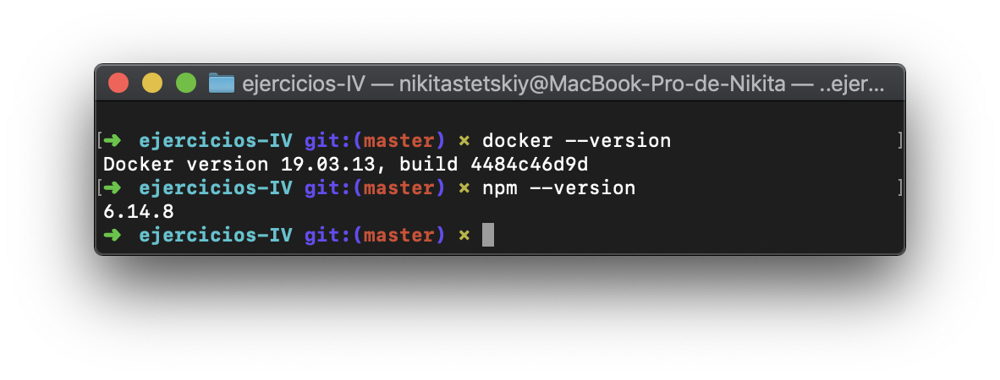
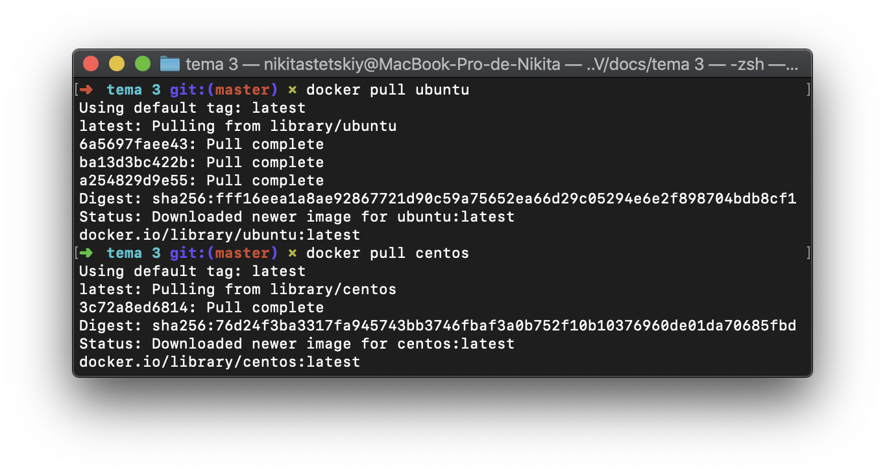
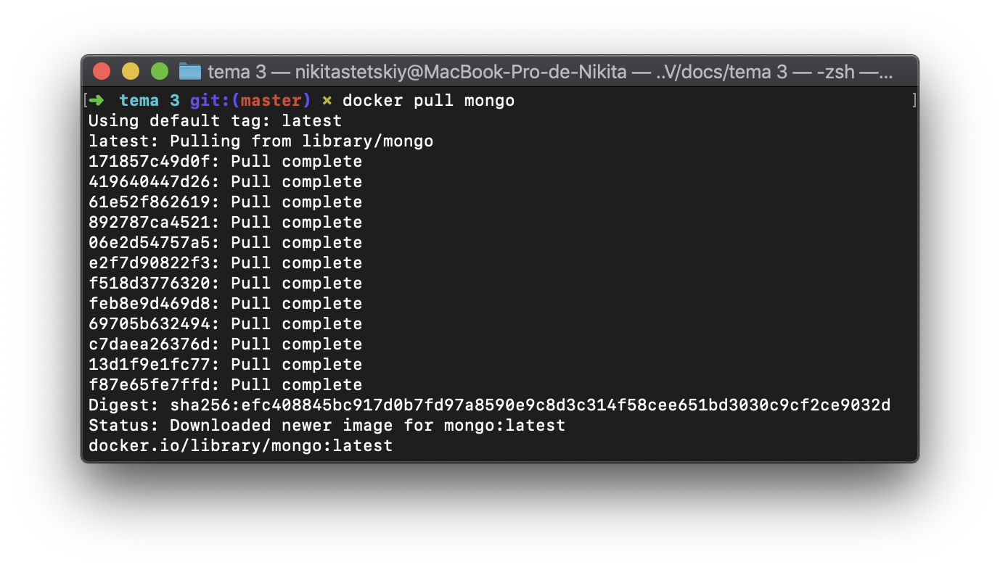
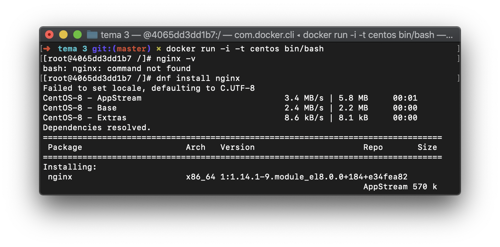
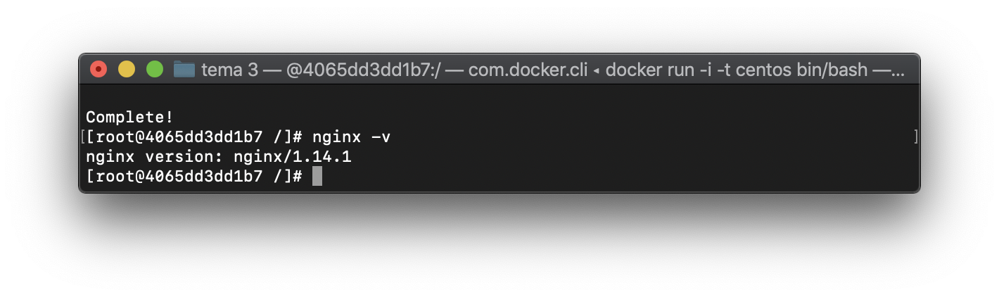

# Resolución ejercicios autoevaluación tema 3
## Ejercicio 1.

Instalación de docker y/o otro gestor de contenedores como Podmn/Buildah:

## Ejercicio 2.

Instalar a partir de docker una imagen alternativa de Ubuntu y alguna adicional, por ejemplo de CentOS.

Buscar e instalar una imagen que incluya MongoDB.

## Ejercicio 3.

Crear un usuario propio e instalar alguna aplicación tal como nginx en el contenedor creado de esta forma, usando las órdenes propias del sistema operativo con el que se haya inicializado el contenedor.

