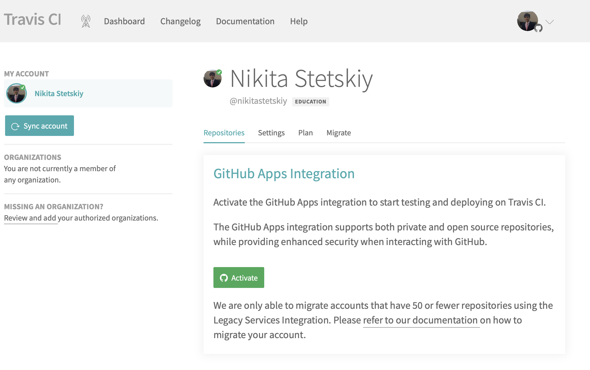

# Resolución ejercicios autoevaluación tema 4

## Ejercicio 9.

1. Darse de alta. Muchos están conectados con GitHub por lo que puedes autentificarte directamente desde ahí. A través de un proceso de autorización, puedes acceder al contenido e incluso informar del resultado de los tests a GitHub.
2. Activar el repositorio en el que se vaya a aplicar la integración continua. Travis permite hacerlo directamente desde tu configuración; en otros se dan de alta desde la web de GitHub.

## Ejercicio 10.

Configurar integración continua para nuestra aplicación usando Travis o algún otro sitio.

Se ha configurado el fichero travis de tal manera que pueda ejecutar los test junto al docker que ya teníamos implementado anteriormente. También se ha añadido una pequeña integración continua en el mismo archivo, el cual hace que se me actualice gh-pages autómaticamente.

