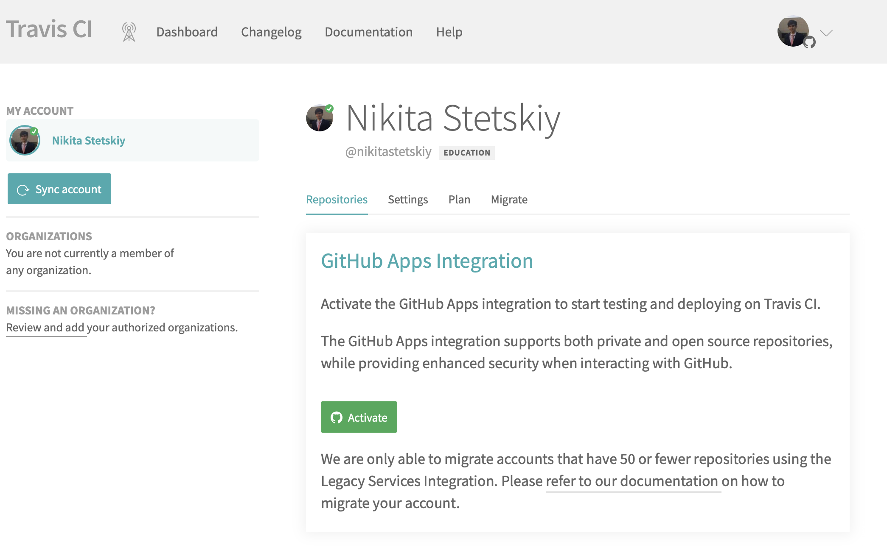
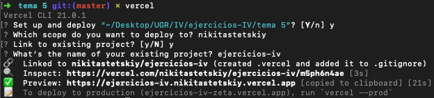

# Resolución ejercicios autoevaluación tema 5

## Ejercicio 1.

Darse de alta en Vercel y Firebase, y descargarse los SDKs para poder trabajar con ellos localmente.

Nos podemos registrar a través de GitHub. Podemos descargarlos de esta manera:

- Vercel: `npm i -g vercel`
- Firebase: `npm i -g firebase-tools`

## Ejercicio 2.

Tomar alguna de las funciones de prueba de Vercel, y hacer despliegues de prueba con el mismo.

- Instalamos: `npm install @vercel/node --save-dev`

Luego:

## Ejercicio 3.

Tomar alguna de las funciones de prueba de Netlify, y hacer despliegues de prueba con el mismo.
