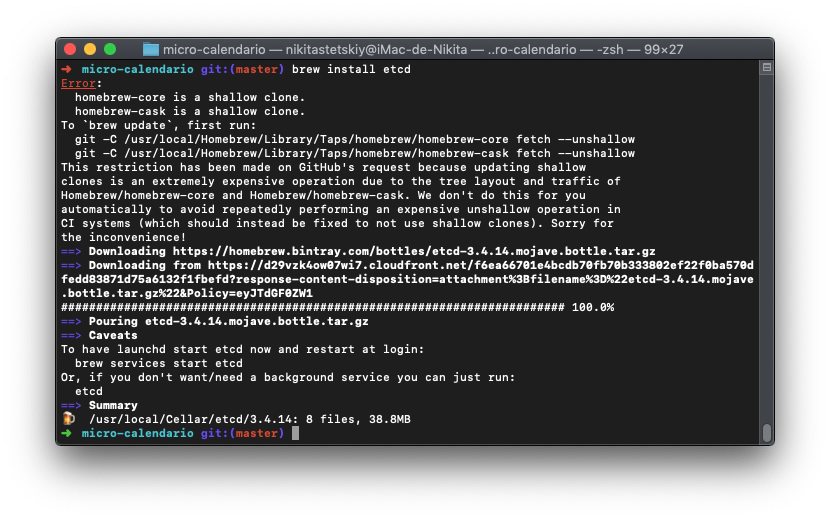
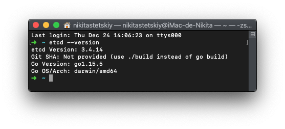

# Resolución ejercicios autoevaluación tema 6

## Ejercicio 1.

Instalar etcd3, averiguar qué bibliotecas funcionan bien con el lenguaje que estemos escribiendo el proyecto (u otro lenguaje), y hacer un pequeño ejemplo de almacenamiento y recuperación de una clave; hacer el almacenamiento desde la línea de órdenes (con etcdctl) y la recuperación desde el mini-programa que hagáis.

## Ejercicio 2.

Realizar una aplicación básica que use express para devolver alguna estructura de datos del modelo que se viene usando en el curso.

He usado Express [aquí](https://github.com/nikitastetskiy/micro-calendario/blob/master/src/routes/routes.js). Ya he utilizado Express en mi aplicación.

## Ejercicio 3.

Programar un microservicio en express (o el lenguaje y marco elegido) que incluya variables como en el caso anterior.

He usado Express [aquí](https://github.com/nikitastetskiy/micro-calendario/blob/master/src/routes/routes.js).

## Ejercicio 4.

Crear pruebas para las diferentes rutas de la aplicación.

He usado supertest [aquí](https://github.com/nikitastetskiy/micro-calendario/blob/master/test/routes.test.js). Ya he utilizado estos test en mi aplicación.