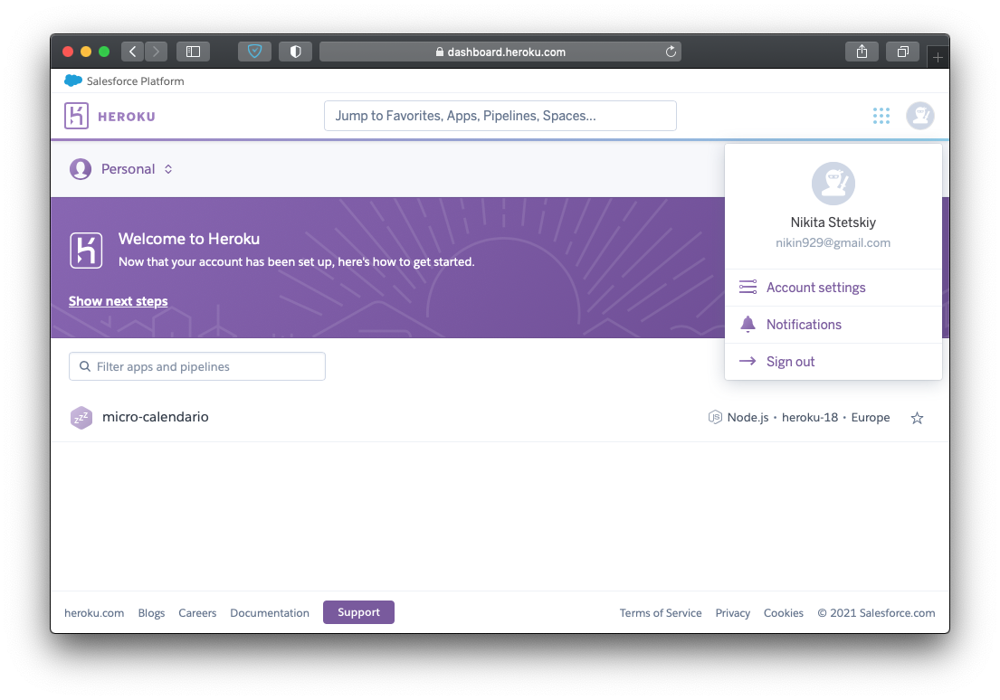
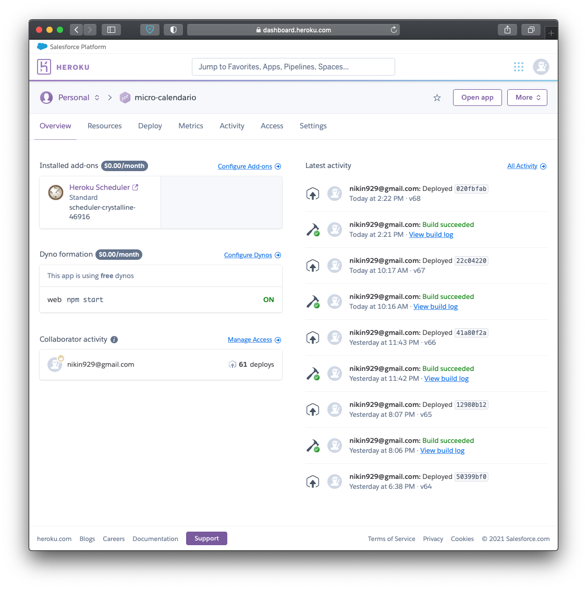

# Resolución ejercicios autoevaluación tema 7

## Ejercicio 1.

Darse de alta en algún servicio PaaS tal como Heroku o BlueMix o usar alguno de los PaaS de otros servicios cloud en los que ya se esté dado de alta.

Me he dado de alta en Heroku.

## Ejercicio 2.

Crear una aplicación en OpenShift o en algún otro PaaS en el que se haya dado uno de alta. Realizar un despliegue de prueba usando alguno de los ejemplos incluidos con el PaaS.

La [aplicación en cuestión](https://github.com/nikitastetskiy/micro-calendario).

## Ejercicio 3.

Instalar y echar a andar tu primera aplicación en Heroku.

La [aplicación en cuestión](https://micro-calendario.herokuapp.com).